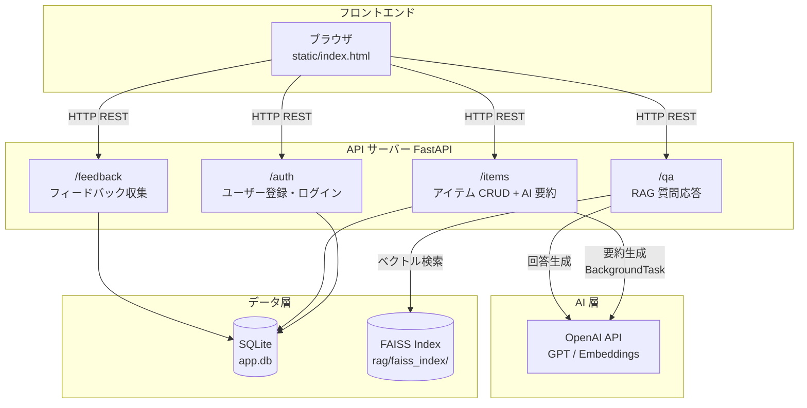
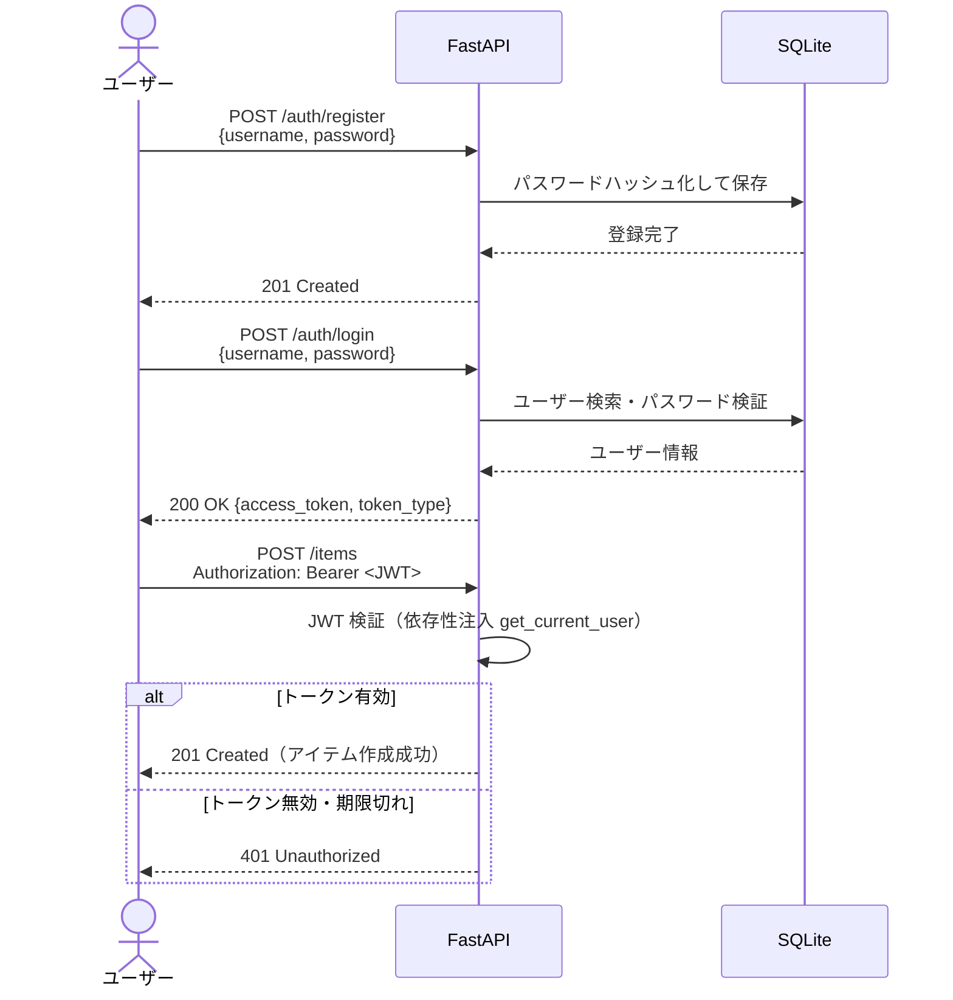

# AI_VSCode — RAG ベース Q&A API

> PDF ドキュメントを知識源とし、FastAPI + OpenAI + FAISS を組み合わせた RAG 質問応答 API。  
> アイテム管理・フィードバック収集・JWT 認証・AI 要約を一体で提供します。

---

## 目次

1. [システム概要](#1-システム概要)
2. [システム構成図](#2-システム構成図)
3. [認証フロー図](#3-認証フロー図)
4. [セットアップ手順](#4-セットアップ手順)
5. [API 仕様一覧](#5-api-仕様一覧)
6. [制約・注意事項](#6-制約注意事項)
7. [改善案](#7-改善案)
8. [採用プロンプト（qa_prompt_v2.yaml）の決定理由](#8-採用プロンプトqa_prompt_v2yamlの決定理由)

---

## 1. システム概要

PDF ドキュメントを FAISS ベクトルインデックスに蓄積し、ユーザーの質問に対して関連チャンクを検索・OpenAI で回答を生成する **Retrieval-Augmented Generation（RAG）** システムです。  
あわせてアイテム投稿（＋AI 要約）、フィードバック（good/bad）、JWT 認証を備えた REST API を提供します。

---

## 2. システム構成図



---

## 3. 認証フロー図



---

## 4. セットアップ手順

### 前提条件

- Python 3.10 以上
- `OPENAI_API_KEY` を取得済みであること

### 手順

```bash
# 1. リポジトリをクローン
git clone <repo-url>
cd AI_VSCode

# 2. 仮想環境を作成・有効化
python -m venv .venv

# Windows (PowerShell)
.\.venv\Scripts\Activate.ps1

# macOS / Linux
source .venv/bin/activate

# 3. 依存パッケージをインストール
pip install -r requirements.txt

# 4. 環境変数ファイルを作成（Git 管理外）
cp .env.example .env          # .env.example がある場合
# または手動で .env を作成して以下を記載
#   OPENAI_API_KEY=sk-xxxxxxxxxxxxxxxx
#   SECRET_KEY=<任意の秘密鍵>

# 5. データベースを初期化（初回のみ）
python -c "from database import Base, engine; Base.metadata.create_all(engine)"

# 6. API サーバーを起動
uvicorn app.main:app --reload
```

ブラウザで `http://localhost:8000` にアクセスするとフロントエンドが表示されます。  
インタラクティブな API ドキュメントは `http://localhost:8000/docs` で確認できます。

---

## 5. API 仕様一覧

### 認証不要

| メソッド | エンドポイント | 説明 |
|----------|---------------|------|
| GET | `/` | フロントエンド HTML を返す |
| GET | `/health` | ヘルスチェック（`{"status": "ok"}`） |
| POST | `/auth/register` | 新規ユーザー登録（username / password） |
| POST | `/auth/login` | ログイン → JWT アクセストークンを発行 |
| POST | `/qa/` | RAG Q&A：質問テキストを送信し、回答と引用元を取得 |

### 認証必須（Bearer JWT）

| メソッド | エンドポイント | 説明 |
|----------|---------------|------|
| GET | `/items` | アイテム一覧を取得（ID・タイトル・本文・AI 要約） |
| POST | `/items` | アイテムを作成（投稿後にバックグラウンドで AI 要約を生成） |

### フィードバック

| メソッド | エンドポイント | 説明 |
|----------|---------------|------|
| POST | `/feedback/` | 指定アイテムに good / bad の評価を送信 |
| GET | `/feedback/summary` | good 件数・bad 件数・good 率（%）の統計を取得 |

---

## 6. 制約・注意事項

| 項目 | 内容 |
|------|------|
| `.env` | `OPENAI_API_KEY` や `SECRET_KEY` を含む。**Git 管理外（.gitignore に追加必須）** |
| `app.db` | SQLite のデータファイル。**Git 管理外**。本番環境では PostgreSQL 等への移行を推奨 |
| `rag/faiss_index/` | FAISS インデックスのバイナリ。別途 `data/` 配下の PDF から生成が必要 |
| JWT 有効期限 | デフォルト設定を確認の上、本番では適切な有効期限（例：30 分）に変更すること |
| CORS | 開発中はすべてのオリジンを許可している場合があるため、本番では制限すること |
| SQLite 同時書き込み | 高負荷環境では競合が発生しうる。スケールアウトには PostgreSQL へ移行すること |
| AI コスト | `/items` 投稿・`/qa/` 呼び出しごとに OpenAI API が課金される。`logs/token_usage.csv` でトークン使用量を確認可能 |

---

## 7. 改善案

### コスト削減

| 対象 | 現状 | 改善案 |
|------|------|--------|
| AI 要約 | 全投稿で実行 | 本文が一定文字数以上の場合のみ要約を実行 |
| RAG 検索数 | `k=3` 固定 | 質問の長さや複雑さに応じて動的に調整 |
| モデル | `gpt-4o` 等 | 要約には `gpt-4o-mini` 等の軽量モデルを使用してコスト削減 |

### 今後の拡張アイデア

- **ユーザーロール（RBAC）**: 管理者・一般ユーザーの権限分離
- **ページネーション**: `/items` に offset / limit パラメータを追加
- **FAISS 再構築 API**: `data/` フォルダへの PDF 追加後に管理者がインデックスを更新できるエンドポイント
- **非同期 DB セッション**: SQLAlchemy の `AsyncSession` に移行してスループット向上
- **Docker Compose**: API・DB・Nginx をコンテナとして一括起動できる構成
- **CI/CD**: GitHub Actions でテスト・Lint・コンテナビルドを自動化

---

## 8. 採用プロンプト（qa_prompt_v2.yaml）の決定理由

採用バージョン: **`prompts/qa_prompt_v2.yaml`**

### 評価結果の比較

最新評価ファイル（`eval/results/eval_comparison_20260619_090940.csv`）より：

| 指標 | v1 | v2 | 差分 |
|------|----|----|------|
| 平均総合スコア | 3.47 | **3.65** | +0.18 |
| 簡潔性（平均） | 2.9 | **3.5** | +0.6 |
| 正確性（平均） | 同水準 | 同水準 | ≒0 |
| 根拠スコア（平均） | 同水準 | 同水準 | ≒0 |
| 分散（総合） | 0.1156 | 0.1510 | +0.035 |

### 決定理由

1. **簡潔性の大幅改善**: v2 では「回答は 1〜3 文で簡潔に」というルールを明示的に追加したことで、簡潔性スコアが `2.9 → 3.5` に向上しました。
2. **総合品質の向上**: 正確性・根拠スコアを維持しながら総合スコアも `3.47 → 3.65` に改善しています。
3. **分散のトレードオフ許容**: 分散がわずかに増加（0.1156 → 0.1510）しましたが、平均スコアの向上と簡潔性の改善効果がそれを上回ると判断しました。

以上より、**回答品質と簡潔性を両立できる `qa_prompt_v2.yaml`** を採用します。

---

## ディレクトリ構成

```
AI_VSCode/
├── app/
│   ├── main.py              # FastAPI アプリケーション本体・ルーター登録
│   ├── dependencies.py      # JWT 認証の依存性注入（get_current_user）
│   ├── routers/
│   │   ├── auth.py          # /auth：ユーザー登録・ログイン
│   │   ├── items.py         # /items：アイテム CRUD + AI 要約
│   │   ├── qa.py            # /qa：RAG 質問応答
│   │   └── feedback.py      # /feedback：フィードバック収集
│   └── services/
│       ├── auth.py          # JWT 生成・パスワードハッシュ
│       ├── summarize.py     # OpenAI による本文要約
│       └── token_logger.py  # トークン使用量の CSV ロギング
├── rag/
│   ├── rag_pipeline.py      # FAISS 検索 + OpenAI 回答生成
│   └── faiss_index/         # ベクトルインデックス（Git 管理外推奨）
├── eval/
│   ├── eval_pipeline.py     # プロンプト評価スクリプト
│   └── results/             # 評価結果 CSV
├── models/                  # SQLAlchemy ORM モデル
├── prompts/                 # プロンプトテンプレート YAML
├── static/
│   └── index.html           # フロントエンド SPA
├── logs/
│   └── token_usage.csv      # OpenAI トークン使用量ログ
├── database.py              # SQLite 接続設定
├── requirements.txt         # Python 依存パッケージ
├── Dockerfile               # コンテナイメージ定義
└── .env                     # 環境変数（Git 管理外）
```
